<<<<<<< HEAD
<<<<<<< HEAD
# 🧠 MotionMendVR

## 📋 Índice


- [Sobre o Projeto](#sobre-o-projeto)
- [Significado do Nome](#-significado-do-nome)
- [Como Funciona](#-como-funciona)
  - [Aplicação Externa (Configuração)](#aplicação-externa-configuração)
  - [Simulação Interativa (Paciente)](#simulação-interativa-paciente)
- [Estrutura do Projeto](#estrutura-do-projeto)
  - [Parte Web (Aplicação Externa)](#-parte-web-aplicação-externa)
  - [Simulação (Realidade Virtual)](#simulação-interativa-paciente)
- [Configuração da Parte Web (ASP.NET MVC)](#-configuração-da-parte-web-aspnet-mvc)
  - [Pré-requisitos](#-pré-requisitos)
  - [Passos de Configuração](#1️⃣-passo-1-fazer-unzip-do-site)
- [Build e Instalação no Meta Quest](#-build-e-instalação-no-meta-quest)
  - [Gerar APK no Unity](#-gerar-apk-no-unity)
  - [Instalar APK no Meta Quest](#-instalar-apk-no-meta-quest)
  - [Executar Aplicação no Meta Quest](#️-executar-aplicação-no-meta-quest)
- [Base de Dados (SQL Server)](#️-base-de-dados-sql-server)
  - [Resumo das Tabelas](#-resumo-das-tabelas)
- [Funcionalidades e Páginas do Site Web](#-funcionalidades-e-páginas-do-site-web)
  - [Login](#-login)
  - [Criação de Conta](#-criação-de-conta)
  - [Homepage](#-homepage)
  - [Perfil](#-perfil)
  - [Definições (Game Settings)](#️-definições-game-settings)
  - [Definições Padrão](#-definições-padrão)
  - [Definições Personalizadas](#-definições-personalizadas)
  - [Conteúdo do Ficheiro de Configurações](#-conteúdo-do-ficheiro-de-configurações)
  - [Next Step](#️-next-step)
- [Dentro da Simulação](#-dentro-da-simulação)
  - [Menu Principal](#menu-principal)
  - [Iniciar Simulação](#iniciar-simulação)
  - [Tela de Carregamento](#tela-de-carregamento)
  - [Início da Simulação](#iniciar-simulação)
  - [Mecânica de Jogo](#mecânica-de-jogo)
  - [Fim do Nível](#fim-do-nível)
  - [Múltiplos Níveis](#múltiplos-níveis)
  - [Fim da Simulação](#fim-da-simulação)
- [Inserção de Resultado da Simulação no Site Web](#-inserção-de-resultado-da-simulação-no-site-web)
  - [Conteúdo do Ficheiro do Resultado](#conteúdo-do-ficheiro-do-resultado)
  - [Análise Resultado](#análise-resultado)
- [Resumo Final](#resumo-final)


---

## Sobre o Projeto

O **MotionMendVR** é um projeto que integra uma **aplicação externa** e uma **simulação interativa** em Realidade Virtual, desenvolvido para promover a **mobilização articular** e a **coordenação óculo-manual** em pessoas com **Doença de Parkinson**.

---

## 🎯 Significado do Nome

| Termo | Significado |
| :---- | :----------- |
| **Motion** | Movimento (prática de atividades físicas) |
| **Mend** | Consertar / Reparar (auxílio na recuperação e melhoria do utilizador) |
| **VR** | Realidade Virtual (tecnologia utilizada no projeto) |

> **MotionMendVR** = Movimento que repara através da Realidade Virtual

---

## 🎮 Como Funciona

### Aplicação Externa (Configuração)
- Utilizada por **fisioterapeutas ou acompanhantes**
- Permite personalizar os parâmetros da simulação:
  - Número de níveis
  - Quantidade de alvos (targets)
  - Tempo limite para tocar nos alvos
- Indica a **distância entre o ombro e os targets**

### Simulação Interativa (Paciente)
- O paciente, **sentado**, alcança targets posicionados à sua frente, ao lado e em diferentes alturas
- **13 targets** no total:
  - 6 para o membro superior **esquerdo**
  - 6 para o membro superior **direito**
  - 1 acima da **cabeça**
- Os targets aparecem de forma **aleatória**
- Cada toque num target → **+1 ponto**
- Se o paciente não tocar no target dentro do **tempo limite** → **-1 ponto**
- O tempo limite pode ser ajustado para tornar o processo de tomada de decisão mais rápido à medida que o utilizador melhora

---

## Estrutura do Projeto

### 🌐 Parte Web (Aplicação Externa)
| Tecnologia | Função |
| :--------- | :----- |
| **C#** | Backend (lógica de negócio, controladores) |
| **ASP.NET MVC** | Arquitetura da aplicação web |
| **HTML + CSS + JavaScript** | Interface gráfica e interação com o utilizador |
| **AJAX** | Comunicação assíncrona com o servidor (sem recarregar a página) |
| **SQL Server** | Base de dados para armazenar configurações, pacientes, níveis, etc. |

### 🥽 Simulação (Realidade Virtual)
| Tecnologia | Função |
| :--------- | :----- |
| **Unity (C#)** | Desenvolvimento da simulação interativa em VR |
| **XML** | Troca de dados entre a aplicação web e a simulação (configurações, pontuações, etc.) |
| **Dispositivo VR** | Execução da simulação pelo paciente |

---

## 🌐 Configuração da Parte Web (ASP.NET MVC)

Este guia fornece instruções passo a passo para configurar e executar a **Aplicação Web** do MotionMendVR no seu computador.

### 📋 Pré-requisitos

- **SQL Server** (Express ou superior)
- **Visual Studio** (2019 ou superior)
- **.NET Framework** 4.7.2 ou superior

---

### 1️⃣ Passo 1: Fazer Unzip do Site

1. Localize o ficheiro **MontionMendvr.zip** na pasta do projeto
2. Clique com o botão direito no ficheiro e selecione **"Extrair Tudo..."**
3. Escolha a localização de destino e clique em **"Extrair"**

> Os ficheiros do site estarão agora descompactados e prontos para abrir

---

### 2️⃣ Passo 2: Colocar a Base de Dados no SQL Server

1. Abra o **SQL Server Management Studio**
2. Verifique o nome do seu servidor (irá precisar mais tarde)
3. Clique com o botão direito em **"Databases"** e selecione **"Restaurar Base de Dados..."** (se tiver um backup)
   - **OU** execute o script SQL manualmente:
   - Clique em **"Nova Consulta"**
   - Copie e cole o conteúdo do ficheiro **MontionMendVR.sql**
   - Clique em **"Executar"** (F5)

> Se ocorrerem erros de execução, terá de criar manualmente a base de dados, tabelas e dados conforme indicado no script

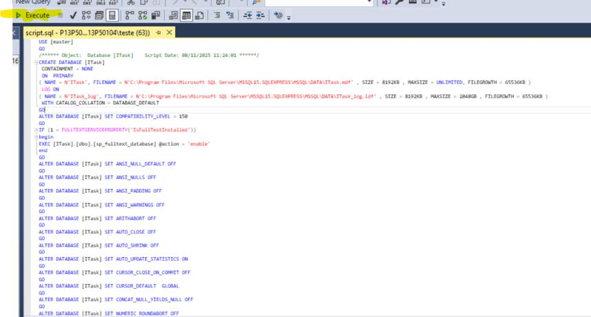

---

### 3️⃣ Passo 3: Abrir o Site no Visual Studio

1. Abra o **Visual Studio**
2. Clique em **"Ficheiro"** → **"Abrir"** → **"Projeto/Solução"**
3. Navegue para a pasta onde extraiu o ficheiro zip
4. Selecione o ficheiro **.sln** (solução do projeto)
5. Clique em **"Abrir"**

> O projeto será carregado no Visual Studio e poderá ver toda a estrutura


---

### 4️⃣ Passo 4: Editar o Ficheiro web.config

1. No **Explorador de Soluções**, localize o ficheiro **web.config**
2. Clique com o botão direito e selecione **"Editar"**
3. Procure pela tag `<connectionStrings>`
4. **Elimine todo o conteúdo dentro dessa tag**, deixando apenas:

```xml
<connectionStrings>
</connectionStrings>
```

5. **Guarde o ficheiro** (Ctrl+S)

> Esta ação remove as strings de ligação antigas para que possa configurar uma nova ligação

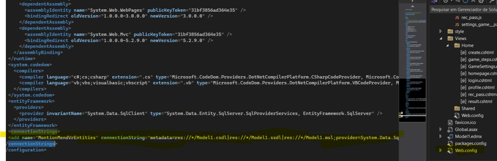

---

### 5️⃣ Passo 5: Eliminar Ficheiro Model1.edmx (Se Existir)

1. No **Explorador de Soluções**, procure pelo ficheiro **Model1.edmx**
2. Se o ficheiro existir:
   - Clique com o botão direito
   - Selecione **"Eliminar"**
   - Confirme a eliminação

> Este ficheiro será regenerado no passo seguinte com a nova configuração

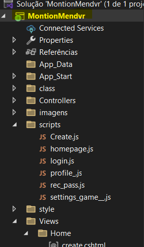

---

### 6️⃣ Passo 6: Adicionar Novo Item ao Projeto

1. Clique com o botão direito no **projeto** (nome da solução no Explorador de Soluções)
2. Selecione **"Adicionar"**
3. Clique em **"Novo Item"**

> Aparecerá uma janela de diálogo com opções de criação

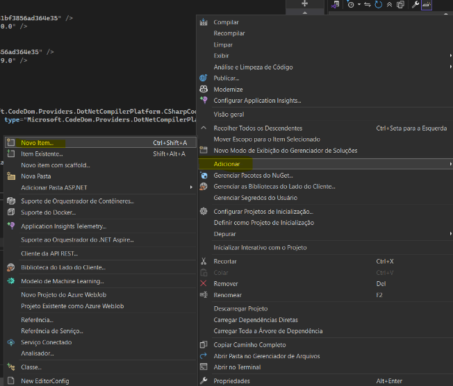

---

### 7️⃣ Passo 7: Selecionar Modelo de Dados

1. Na janela que se abre, selecione a categoria **"Dados"** (no lado esquerdo)
2. Procure por **"ADO.NET Entity Data Model"** ou **"Entity Data Model"**
3. Clique para selecionar esse item
4. Clique em **"Adicionar"**

> Isto irá iniciar o assistente de criação do modelo de dados

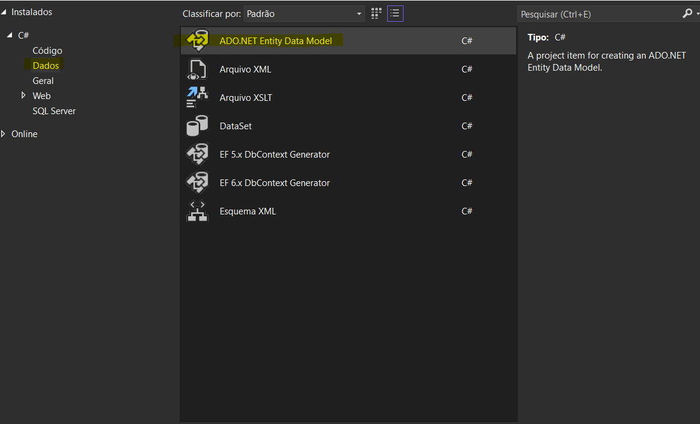

---

### 8️⃣ Passo 8: Clicar na Opção "Entity Data Model Wizard"

1. Na primeira janela do assistente, selecione a opção:
   - **"EF Designer from database"** (ou semelhante)
   - OU **"Gerar a partir da base de dados"**
2. Clique em **"Avançar"** (Next/Suivant)

> Esta opção permite criar o modelo a partir das tabelas existentes

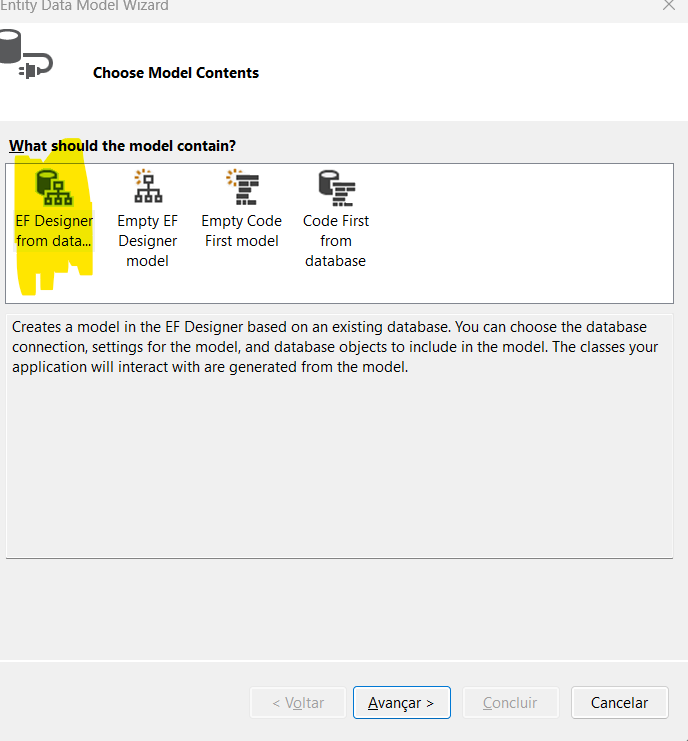

---

### 9️⃣ Passo 9: Criar Nova Ligação

1. Na próxima janela, procure pelo botão **"Nova Ligação"** (New Connection)
2. Clique nesse botão

> Isto abrirá o diálogo para configurar a ligação ao SQL Server

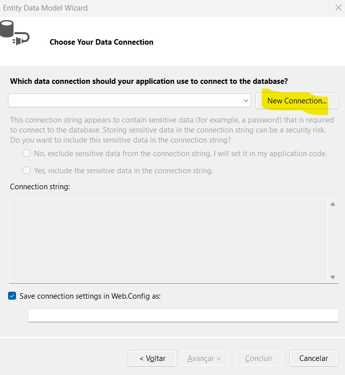

---

### 🔟 Passo 10: Copiar Nome do Servidor SQL

1. Abra o **SQL Server Management Studio**
2. Na barra de título ou no painel de ligação, encontre o **nome do seu servidor**
3. Exemplo: `COMPUTADOR-NAME\SQLEXPRESS` ou `localhost`
4. **Copie esse nome**

> Irá precisar desta informação para a próxima etapa

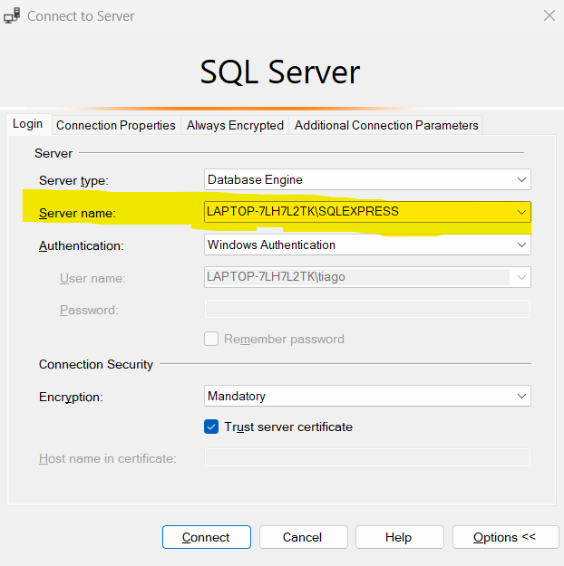

---

### 1️⃣1️⃣ Passo 11: Configurar Ligação ao SQL Server

1. Na janela **"Connection Properties"**:
   - **Nome do Servidor:** Cole o nome que copiou (ex: `COMPUTADOR-NAME\SQLEXPRESS`)
   - **Autenticação:** Selecione **"Windows Authentication"** ou insira credenciais SQL
   
2. **Certificado:** Selecione **"Aceitar certificado de servidor auto-assinado"** (se necessário)

3. **Base de Dados:** Selecione **"MontionMendVR"** da lista (ou clique em "Procurar" para encontrá-la)

4. Clique em **"OK"**

> A ligação será testada e validada

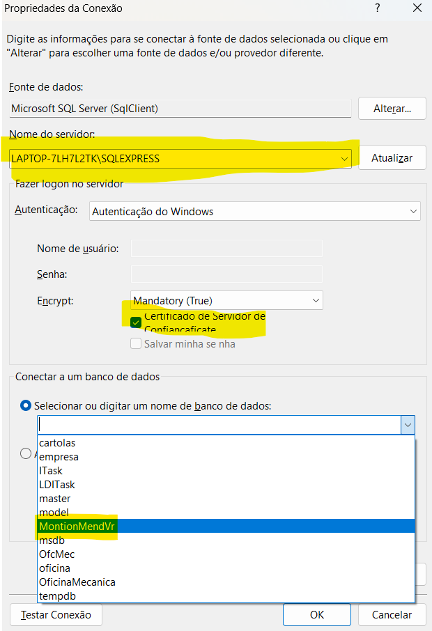

---

### 1️⃣2️⃣ Passo 12: Prosseguir no Assistente

1. Após clicar em OK, voltará à janela anterior
2. Clique em **"Avançar"** novamente

> O sistema irá estabelecer ligação à base de dados

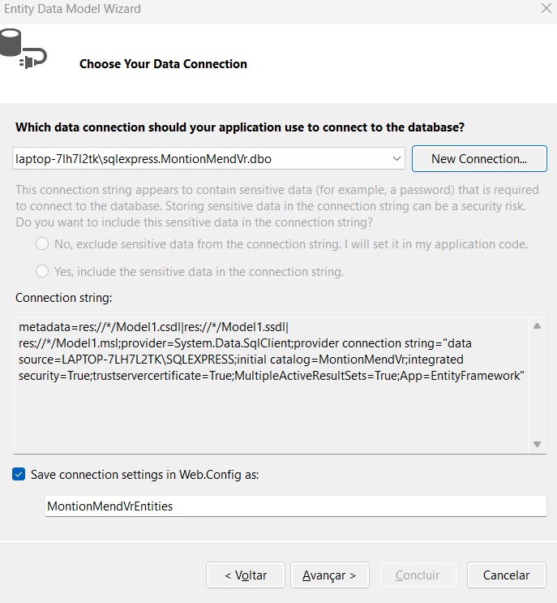

---

### 1️⃣3️⃣ Passo 13: Selecionar Tabelas e Procedimentos

1. Na janela de seleção de objetos:
   - Marque a caixa ao lado de **"Tables"** (Tabelas)
   - Marque a caixa ao lado de **"Stored Procedures and Functions"** (Procedimentos Armazenados e Funções)

2. Clique em **"Concluir"** (Finish)

> Isto irá gerar o modelo de dados com as tabelas e procedimentos

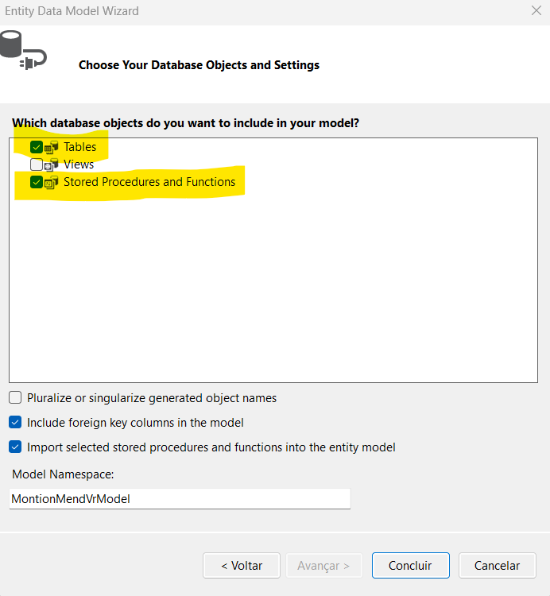

---

### 1️⃣4️⃣ Passo 14: Confirmar Mensagens de Aviso

1. Se aparecer uma mensagem de aviso sobre **"Pluralization"** ou similares:
   - Clique em **"OK"**

2. Se aparecer uma mensagem pedindo confirmação para atualizar o web.config:
   - Clique em **"Sim para Todos"** (Yes to All)

> O ficheiro web.config será automaticamente atualizado com a string de ligação correta

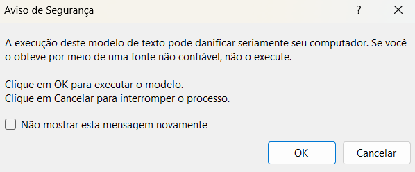

---

### 1️⃣5️⃣ Passo 15: Executar o Site e Fazer Login

1. Pressione **F5** ou clique em **"Iniciar Depuração"** (Start Debugging)

2. O site será aberto no seu navegador padrão

3. Na página de **login**, insira:
   - **Utilizador:** `jorge_7`
   - **Palavra-passe:** `C@stro773`

4. Clique em **"Entrar"** ou **"Login"**

> Deverá ser redirecionado para a página inicial da aplicação

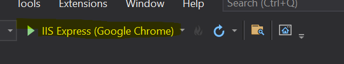

---

## 🥽 Build e Instalação no Meta Quest

Esta secção descreve o processo de gerar o APK (ficheiro de instalação) da aplicação no Unity e instalá-lo no dispositivo Meta Quest.

### 📦 Gerar APK no Unity

Para gerar o ficheiro APK da aplicação no Unity, siga os seguintes passos:

#### 1️⃣ Abrir Build Settings

No Unity, aceder a:

```
File → Build Settings
```

#### 2️⃣ Selecionar Plataforma Android

Na janela de **Build Settings**:
- Selecionar **Android**
- Clicar em **"Switch Platform"**

> Isto irá mudar a plataforma de compilação para Android

#### 3️⃣ Gerar o APK

Após a configuração:
1. Clicar em **"Build"** ou **"Build and Run"**
2. Escolher a localização onde guardar o ficheiro
3. Aguardar a compilação (pode demorar alguns minutos)

O ficheiro gerado terá o nome: `nomedaaplicacao.apk`

---

### 📲 Instalar APK no Meta Quest

1. **Conectar o Meta Quest ao computador** com o cabo USB  
2. **Autorizar a conexão** no headset (confirmar prompt de permissão)  

---

🎥 **Vídeo explicativo (clique na imagem):**

[](https://www.youtube.com/watch?v=zzizceAOW-w)
---

### ▶️ Executar Aplicação no Meta Quest

Após a instalação bem-sucedida:

1. **Colocar o headset** na cabeça
2. **Abrir aplicações:**
   - Clicar em **Apps** → **Unknown Sources** (ou "Aplicações Desconhecidas")
3. **Localizar a aplicação** instalada (MotionMendVR)
4. **Selecionar e executar** normalmente

> A aplicação irá funcionar no dispositivo Meta Quest!

---

## 🗄️ Base de Dados (SQL Server)

A base de dados do **MotionMendVR** é composta por 7 tabelas principais, que armazenam desde os dados dos utilizadores até aos resultados das simulações.


---

### 📋 Resumo das Tabelas

#### 👤 Tabela `User`

| Campo | Descrição |
| :---- | :-------- |
| **username** (PK) | Chave primária. Identificador único do utilizador |
| nome | Nome completo do utilizador |
| senha | Password de acesso |
| data_nascimento | Data de nascimento |
| email | Endereço de email |
| **nacionalidade** (FK) | Chave estrangeira para a tabela `nacionalidades` |

**Relações:**
- → `nacionalidades` (nacionalidade)
- → `ficheiro` (username)
- → `ficheiro_resultado` (username)

---

#### 🌍 Tabela `nacionalidades`

| Campo | Descrição |
| :---- | :-------- |
| **nacionalidade** (PK) | Chave primária. Nome da nacionalidade (ex: Portuguesa, Brasileira) |

**Relações:**
- ← `User` (nacionalidade)

---

#### 📄 Tabela `ficheiro`

| Campo | Descrição |
| :---- | :-------- |
| **nome_do_ficheiro** (PK) | Chave primária. Nome único do ficheiro de configuração |
| **username** (FK) | Chave estrangeira para a tabela `User` (quem criou o ficheiro) |
| quantidade_niveis | Número de níveis da simulação |
| quantidade_bolas | Número de bolas/alvos por nível |
| tipo | Tipo de ficheiro (personalizado ou padrão) |
| data_criacao | Data de criação do ficheiro |

**Relações:**
- ← `User` (username)
- → `nível_ficheiro` (nome_do_ficheiro)
- → `ficheiro_bola` (nome_ficheiro)
- → `ficheiro_resultado` (nome_ficheiro)

---

#### 📊 Tabela `nível_ficheiro`

| Campo | Descrição |
| :---- | :-------- |
| **id_nivel_ficheiro** (PK) | Chave primária. Identificador único do nível |
| **nome_do_ficheiro** (FK) | Chave estrangeira para a tabela `ficheiro` |
| tempo | Tempo limite para o nível |
| nivel | Número do nível (ex: 1, 2, 3...) |

**Relações:**
- ← `ficheiro` (nome_do_ficheiro)

---

#### 🎯 Tabela `ficheiro_bola`

| Campo | Descrição |
| :---- | :-------- |
| **id_ficheiro_bola** (PK) | Chave primária. Identificador único da associação |
| **nome_ficheiro** (FK) | Chave estrangeira para a tabela `ficheiro` |
| **id_bola** (FK) | Chave estrangeira para a tabela `bolas` |

**Relações:**
- ← `ficheiro` (nome_ficheiro)
- ← `bolas` (id_bola)

---

#### ⚽ Tabela `bolas`

| Campo | Descrição |
| :---- | :-------- |
| **id_bola** (PK) | Chave primária. Identificador único da bola/alvo |
| posicao_x | Coordenada X no espaço 3D |
| posicao_y | Coordenada Y no espaço 3D |
| posicao_z | Coordenada Z no espaço 3D |
| tipo | Posição da bola (esquerda, direita ou frente) |

**Relações:**
- → `ficheiro_bola` (id_bola)
- → `ficheiro_resultado` (id_alvo)

---

#### 📈 Tabela `ficheiro_resultado`

| Campo | Descrição |
| :---- | :-------- |
| **id_ficheiro_resultado** (PK) | Chave primária. Identificador único do resultado |
| **nome_ficheiro** (FK) | Chave estrangeira para a tabela `ficheiro` |
| **username** (FK) | Chave estrangeira para a tabela `User` |
| tocou | Indica se a bola/alvo foi tocada (true/false) |
| tempo_reacao | Tempo que o utilizador levou para tocar no alvo |
| id_alvo | Identificador do alvo (relacionado com `bolas`) |
| nivel | Nível em que o utilizador estava quando tocou no alvo |

**Relações:**
- ← `ficheiro` (nome_ficheiro)
- ← `User` (username)
- ← `bolas` (id_alvo)

---


## 🌐 Funcionalidades e Páginas do Site Web

---

### 🔐 Login

Ao iniciar a aplicação, o utilizador é apresentado com uma página de **login** onde deve inserir as suas credenciais de conta, caso já possua uma conta criada.

**Características:**
- Ao lado do campo da palavra-passe, existe um ícone de **cadeado**.
  - Ao clicar neste ícone, a palavra-passe torna-se **visível**.
  - Ao clicar novamente, a palavra-passe fica **ocultada**.
- Abaixo do botão de login, encontra-se uma label com a indicação **"Criar nova conta"**.
- Se as credenciais inseridas estiverem **incorretas**, será exibida uma mensagem de erro.
- Se não tiver uma conta, clique em **"Criar nova conta"** para iniciar o processo de criação.


---

### 📝 Criação de Conta

Na página de criação de nova conta, o utilizador deve preencher os seguintes campos:

| Campo | Regras / Validações |
| :---- | :------------------ |
| **Username** | Único. Identifica cada utilizador |
| **Nome do Utilizador** | Nome completo |
| **Email** | Não podem existir contas com o mesmo email |
| **Palavra-passe** | Mínimo 8 caracteres, contendo: 1 letra minúscula, 1 letra maiúscula, 1 dígito, 1 caractere especial |
| **Data de Nascimento** | O utilizador deve ter **pelo menos 13 anos** |
| **Nacionalidade** | Campo com **autocomplete** |

**Observações:**
- Abaixo do botão **"Criar conta nova"** existe uma etiqueta que leva o utilizador de volta à página de login.
- **Não é permitido deixar nenhum campo vazio.**
- Caso algum campo esteja preenchido incorretamente, será mostrada uma mensagem de erro indicando o problema.
- Se a criação da conta for bem-sucedida:
  - O utilizador é adicionado à base de dados através de uma **Stored Procedure (SP)**
  - É automaticamente **redirecionado** para a página de login


---

### 🏠 Homepage

Ao chegar a esta página, o utilizador é recebido com uma **mensagem de boas-vindas personalizada**, incluindo o seu username.

**Estrutura da página:**
- Abaixo da mensagem de boas-vindas, há um texto motivacional para encorajar o utilizador.
- Dois botões principais:
  - **"Simulation Result"** → Redireciona para a página de resultados da simulação
  - **"Create Game Settings"** → Encaminha para a página de criação das configurações da simulação
- No **canto superior esquerdo**, encontra-se o **botão de menu**:
  - Home
  - Profile
  - Simulation Result
  - Game Settings
  - Logout


---

### 👤 Perfil

O perfil mostra as informações do utilizador:

| Informação | Descrição |
| :--------- | :-------- |
| **Username** | Nome de utilizador (não editável) |
| **Nome** | Nome completo |
| **Email** | Endereço de email |
| **Nacionalidade** | País de origem |
| **Data de Nascimento** | Data de nascimento do utilizador |

**Funcionalidades:**
- Abaixo das informações pessoais, existe um botão que permite **alterar** todas as informações apresentadas, **exceto o username**.
- **Validações importantes:**
  - Email não pode ser repetido
  - Nacionalidade deve ser válida
  - Data de nascimento deve indicar que o utilizador tem **pelo menos 13 anos**
- Caso alguma informação esteja incorreta → mensagem de erro explicativa
- Se a informação estiver correta → as atualizações são feitas na base de dados através de uma **Stored Procedure**


---

### ⚙️ Definições (Game Settings)

Nesta página, o utilizador consegue visualizar o **botão menu** (com as opções previamente referidas).

**Conteúdo da página:**
- Texto explicativo sobre como o utilizador pode definir as suas configurações
- Dois botões na parte inferior:
  - **Definições Padrão** → Selecionar configurações pré-definidas
  - **Definições Personalizadas** → Criar configurações à medida


---

### 🎯 Definições Padrão

Após clicar no botão **"Definições Padrão"**, aparecerão **quatro imagens**, cada uma correspondente a uma configuração padrão:

| Imagem | Número de Alvos | Dificuldade |
| :----- | :-------------- | :---------- |
| 1ª imagem | 4 alvos | Baixa |
| 2ª imagem | 8 alvos | Média |
| 3ª imagem | 12 alvos | Alta |
| 4ª imagem | 13 alvos | Máxima |

> Quanto maior o número de alvos, maior a dificuldade e mais níveis estarão presentes nas configurações padrão.

**Processo:**
1. Escolher a configuração desejada
2. Clicar em **"Salvar"**
3. A informação é guardada na base de dados através de uma **Stored Procedure**
4. O utilizador é redirecionado para a página **"Next Step"** (explicação de como introduzir o ficheiro nos Oculus VR)


---

### 🎨 Definições Personalizadas

Caso o utilizador clique no botão para personalizar as configurações, acederá a uma interface completa e interativa para criar as suas próprias definições.

---

#### 🎯 Etapa 1: Configuração de Níveis e Seleção de Alvos

Após clicar em **"Definições Personalizadas"**, a primeira etapa apresenta:

**Interface:**
- Uma imagem com **13 botões**, cada um representando um alvo na simulação:
  - **1 alvo** → acima da cabeça do utilizador
  - **6 alvos** → laterais (3 esquerda + 3 direita)
  - **6 alvos** → meio (3 deslocados para a direita + 3 deslocados para a esquerda)

**Configuração de Níveis:**
- O utilizador pode escolher até **5 níveis** para a simulação
- Ao lado dos níveis, é exibido o **tempo de reação** necessário entre alvos
  - Valor = **0** → sem limite de tempo
- Os níveis podem ser ajustados de forma independente


---

#### ⚙️ Etapa 2: Configuração de Alvos e Finalização

Na segunda etapa, o utilizador configura os parâmetros específicos de cada alvo:

**Configuração de Alvos:**
- Ao clicar num alvo da imagem anterior, aparece uma nova informação referente ao **comprimento do braço** do utilizador
  - Esta informação é **essencial** para definir a distância dos alvos
  - ⚠️ **Aviso importante:** Se inserir um valor superior ao correto, o utilizador poderá ter dificuldades na simulação
- Após definir o comprimento do braço, clique em **"Salvar"** para armazenar a informação desse alvo
  - **Repetir este processo para todos os 13 alvos**

**Botões adicionais (canto inferior direito):**

| Botão | Função |
| :---- | :----- |
| **Limpar** | Apaga todas as informações das definições personalizadas |
| **Criar Ficheiro** | Cria o ficheiro com as definições escolhidas |

**Validação e Conclusão:**
- Se houver **erro** → mensagem de feedback explicativa sobre o problema
- Se estiver **tudo correto**:
  - O ficheiro é **descarregado** automaticamente
  - A configuração é guardada na base de dados através de uma **Stored Procedure**
  - O utilizador é redirecionado para a página **"Next Step"** com instruções de como usar o ficheiro


---

### 📄 Conteúdo do Ficheiro de Configurações

O ficheiro de configurações criado pelo utilizador na aplicação serve para:
- Personalizar a **quantidade de alvos** que irão aparecer na simulação
- Configurar os **níveis disponíveis**
- Definir o **tempo limite de reação** do utilizador durante a interação com os alvos

#### Estrutura do Ficheiro


#### Descrição dos Elementos

| Elemento | Descrição |
| :------- | :-------- |
| `<filename>` | Nome do ficheiro associado às configurações. Ex: `jorge123_1` (username + número total de ficheiros criados para evitar repetições) |
| `<username>` | Nome do utilizador que pretende este ficheiro. Ex: `jorge123` |
| `<level>` | Representa um nível da simulação. O atributo `id` indica o número do nível (ex: nível 1, nível 2) |
| `<time>` | Tempo limite (em segundos) para completar o nível |
| `<ball>` | Representa um alvo. O atributo `id` identifica o alvo |
| `<position>` | Define a posição do alvo nas coordenadas tridimensionais (x, y, z) |

#### Exemplo de Posicionamento de Alvos

| Alvo (id) | Posição (x, y, z) |
| :-------- | :---------------- |
| `1` | (0, 0.5, 0) |
| `5` | (-0.5, 0.5, 0) |

---

### ➡️ Next Step

Após o ficheiro ser descarregado, o utilizador será redirecionado para esta página.

#### Objetivo da Página

- Servir como um **manual de instruções** sobre como colocar as configurações criadas pela aplicação nos **Oculus VR**
- Explicar os **passos seguintes** após o utilizador ter realizado a simulação
- Explicar **como inserir o resultado da simulação** na aplicação

---

#### 🔌 Etapa 1: Ligar e Conectar o Oculus

1. Ligue o **Oculus** e aguarde que o sistema operacional o reconheça
2. Conecte-o ao seu computador utilizando o **cabo USB-C adequado**

> O Oculus aparecerá como um dispositivo externo no seu computador

---

#### 📱 Etapa 2: Autorizar Acesso ao Armazenamento

1. Clique no ícone de **notificação** (representado por um sino) na barra de tarefas do Windows
2. Clique na janela pop-up que diz **"Dispositivo USB ligado"** ou **"Novo dispositivo detectado"**

> O sistema operacional irá solicitar autorização para aceder aos ficheiros do Oculus

---

#### 💾 Etapa 3: Navegar até à Pasta de Destino

1. Após clicar no pop-up, o **armazenamento interno** do Oculus aparecerá no computador (geralmente no Explorador de Ficheiros)
2. Localize e clique em **"Armazenamento interno partilhado"**
3. Navegue até à seguinte pasta: 
   ```
   Android\data\com.DefaultCompany.Jorgecastro_pap\files
   ```

> Se não conseguir encontrar a pasta, pode aceder ao Oculus através de "Este Computador" → "Oculus Quest" → "Armazenamento interno partilhado"

---

#### 📂 Etapa 4: Criar a Pasta MotionMendVR (Se Necessário)

1. Verifique se a pasta **`MotionMendVR`** existe dentro do caminho acima
2. Se a pasta **NÃO existir**:
   - Clique com o botão direito no espaço vazio
   - Selecione **"Criar uma pasta"** ou **"Nova pasta"**
   - Nomeie a pasta como **`MotionMendVR`**

> Esta pasta é onde o ficheiro de configurações será colocado

---

#### 📥 Etapa 5: Inserir o Ficheiro de Configurações

1. Dentro da pasta **`MotionMendVR`**, **cole o ficheiro** que foi descarregado da aplicação web
2. Aguarde que o ficheiro seja copiado completamente (verifique a barra de progresso)

> O ficheiro terá um nome similar a: `jorge_7_1.xml` (username_número.xml)

---

#### 🎮 Etapa 6: Iniciar a Simulação

1. Desconecte o Oculus do computador (removendo o cabo USB)
2. Coloque o **Oculus** na cabeça
3. Inicie a aplicação **MotionMendVR** no seu Oculus
4. O sistema irá carregar o ficheiro de configurações que colocou na pasta

> A simulação está pronta para ser executada com as suas configurações personalizadas!

---


---

## 🎮 Dentro da Simulação

### Menu Principal

Ao entrar na simulação, o utilizador é apresentado com um menu principal que contém quatro opções: **Iniciar**, **Opções**, **Sobre** e **Sair**.

- **Sair**: Se o utilizador clicar nesta opção, ele sairá da aplicação.
- **Opções**: Ao clicar nesta opção, o utilizador pode ajustar o som, controlando o volume do som ambiente, e também pode ajustar a sensibilidade da mão esquerda e da mão direita.
- **Sobre**: Esta opção mostra informações sobre a aplicação, como a sua finalidade e o objetivo da mesma.


### Iniciar Simulação

Ao clicar na opção **Iniciar**, aparece um novo conteúdo onde o utilizador deve inserir o nome específico do ficheiro que contém as configurações.

Durante este processo, se algum erro for detetado, uma mensagem será exibida para informar o utilizador sobre o problema encontrado. Por outro lado, se não houver nenhum erro, a simulação iniciará.


### Tela de Carregamento

Vai haver uma tela de carregamento (load…).


### Início da Simulação

Após a simulação iniciar, todos os alvos são apresentados e é iniciada uma contagem decrescente de 3 segundos.

Após a contagem decrescente, todos os alvos desaparecem. Em seguida, surgem dois canvas, um de cada lado da tela, um exibindo o tempo limite para tocar no alvo e o outro a pontuação.

Quando esses canvas aparecem, surge também o primeiro alvo, que aparece de forma aleatória.


#### Mecânica de Jogo

- Caso o alvo seja tocado, ele desaparece e um novo alvo aparece de forma aleatória, incrementando um ponto à pontuação.
- Se o utilizador não tocar no alvo até o tempo limite, o alvo desaparece e um novo alvo aparece de forma aleatória. Nesse caso, é subtraído um ponto da pontuação, desde que a pontuação seja superior a zero.
- Cada alvo aparece apenas uma vez em cada nível.

#### Fim do Nível

Após completar o nível, aparece um canvas com a pontuação obtida.

#### Múltiplos Níveis

Caso o utilizador tenha inserido mais de um nível, a pontuação é reiniciada e o próximo nível começa de forma semelhante, com a mesma mecânica de alvos aparecendo de forma aleatória e o tempo limite para tocar em cada alvo.

### Fim da Simulação

Caso o utilizador tenha completado a simulação, aparece o resultado do último nível. Em seguida, o menu principal da simulação é exibido novamente, permitindo ao utilizador escolher uma nova ação.

Simultaneamente, é criado um ficheiro com o resultado da simulação.

---


## 📊 Inserção de Resultado da Simulação no Site Web

### Conteúdo do Ficheiro do Resultado

Ficheiro XML com estrutura: `<Analysis>` → `<filename_settings>`, `<username>`, `<Level>` → `<BallID>` → `<Touched>`, `<Time>`


| Campo | Descrição |
| :---- | :-------- |
| **filename_settings** | Nome do ficheiro de configurações (ex: `jorge_7_1`) |
| **username** | Utilizador que realizou a simulação (ex: `jorge_7`) |
| **Level** | Nível da simulação (pode haver múltiplos) |
| **BallID** | Alvo específico dentro do nível |
| **Touched** | `true` (tocado) ou `false` (não tocado) |
| **Time** | Tempo de reação em segundos ou `N/D` (sem tempo) |

### Análise Resultado

#### 📥 Etapa 1: Fazer Upload do Ficheiro

1. Conecte o Oculus ao computador com o cabo USB
2. Clique em **"Escolher ficheiro"** para abrir o explorador
3. Navegue até: `Android\data\com.DefaultCompany.Jorgecastro_pap\files\Result`
4. Selecione o ficheiro com o resultado (nome: `nomedoficheiro_result.xml`)
5. O ficheiro será validado e armazenado na base de dados


#### 📊 Etapa 2: Visualizar Resultados

Após o upload bem-sucedido, a aplicação gera um **gráfico para cada nível** mostrando:
- **Pontuação** obtida em cada sessão
- **Tempo de reação** para cada alvo tocado
- **Progressão** se o utilizador repetiu a simulação com a mesma configuração

Este histórico permite **comparar desempenhos** e identificar alvos com maior dificuldade para melhoria posterior.


## Resumo Final

O **MotionMendVR** é uma solução inovadora que combina Realidade Virtual com reabilitação física para pacientes com Doença de Parkinson. 
Com uma interface intuitiva e atividades interativas, a plataforma promove a mobilização articular e a coordenação óculo-manual de forma segura e motivadora.
O sistema permite que fisioterapeutas personalizem completamente o tratamento enquanto os pacientes se beneficiam de uma experiência imersiva e gamificada que torna a reabilitação mais envolvente.

**Trabalho realizado por:**
- **Jorge Castro** nº 210094


=======
# MotionMendVR-PAP
>>>>>>> 96f2c9e807990651f3b5eb799e8e0867e5bf2b5f
=======
# MotionMendVR-PAP
>>>>>>> 96f2c9e807990651f3b5eb799e8e0867e5bf2b5f
